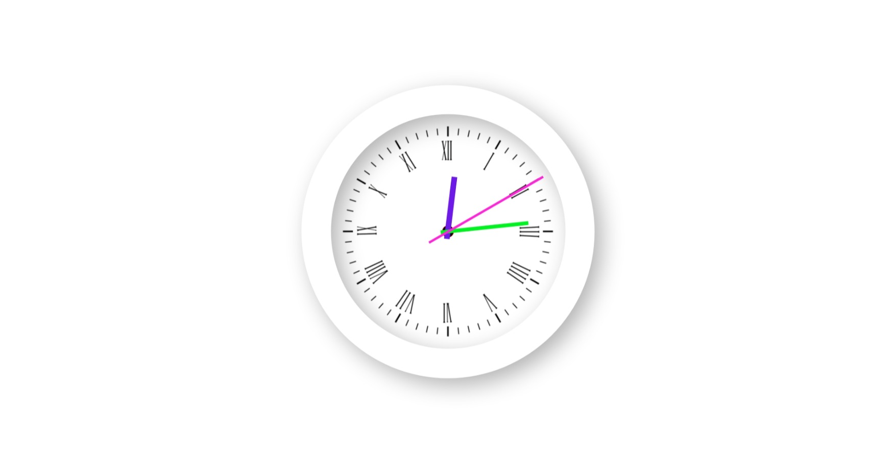

# Analog Clock 🕰️

This repository contains the code for a simple analog clock built using HTML, CSS, and JavaScript.

## Features ✨

- **Visual Appeal:**  The clock has a visually appealing design with a classic clock face and hands.
- **Accurate Time:**  The clock displays the current time accurately and updates in real-time.
- **Responsive Design:** The clock adapts to different screen sizes for optimal viewing.

## Screenshots 📸



## Live Demo 🌎

You can check out the live demo of the analog clock [here.](https://gupta-ravi.github.io/JsAnalogClock/)

## How to Run the Project 🚀

1. **Clone the repository:**
```bash
git clone https://github.com/Gupta-Ravi/JsAnalogClock
```
2. Open the index.html file in your web browser.

## YouTube Tutorial 📺

[Click here for the YouTube Tutorial](https://youtu.be/lWJB_8NGLUs?si=IifQLJh_L6ei_F-4)

## Contributing 🤝

Contributions to this project are welcome! If you have any suggestions or improvements, feel free to submit a pull request.

## License 📄

This project is licensed under the MIT License.

## Files 📂

- **index.html:** The main HTML file for the clock.
- **style.css:** The CSS file for styling the clock.
- **script.js:** The JavaScript file for handling the clock's functionality.
- **clock.png:**  Image of the clock face.

Enjoy building your own analog clock! 😊
